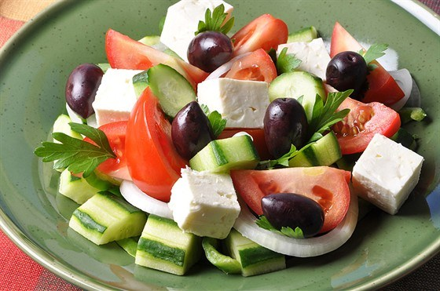

# Греческий салат

 ## Состав
* Оливковое масло extra virgin 2 столовые ложки
* Лимонный сок 1-1,5 столовые ложки
* Чеснок 1 зубчик(по желанию)
Сушеный орегано ½ чайной ложки(по желанию)
* Морская соль ¼ чайной ложки(по желанию)
* Свежемолотый черный перец ¼ чайной ложки(по желанию)
*  Помидоры (можно/лучше черри)
* Красный лук ¼ головки (маленькой головки на две порции слишком много)
* Огурцы ½ штуки
* болгарский (сладкий)перец
* Сыр фета 120 г(любой мягкий сыр, например сиртаки)
* Маслины без косточек
 
  ## Как готовить
 
 
1.заправка: смешиваем оливковое масло, лимонный сок, измельченный чеснок, соль, перец и орегано.
**!Note** можно забить и ограничиться оливковым маслом

2. В большую миску выложите нарезанные небольшими дольками помидоры(черри достаточно пополам разрезать, острым концом ножа начинать резать с середины), нарезанный полукруглыми кусочками огурец, нарезанный тонкими кольцами красный лук(с луком осторожно в плане кол-ва, можно мелко резать), нарезанный тонкими полосками сладкий перец, нарезанную кубиками фету и маслины.

3. Перед подачей полейте заправкой, аккуратно перемешайте и посыпьте сверху свежемолотым черным перцем(по желанию).

  ## Как подавать
  
 На тарелку выложить листья салата,сверху  заправаленный греч. салат
  
  
 

