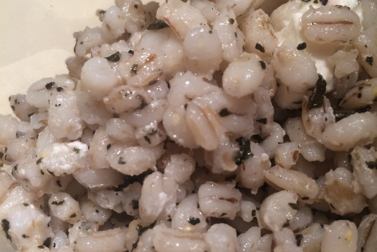

# Перловка с фетой

 ## Состав

* Перловая крупа 300 г
*  мягкий сыр (фета/брынза) 150 г
* Куриный бульон 1,5 л(по желанию)
* Чеснок 4 зубчика
* Красный лук 1 головка
* Лимон 1 штука(по желанию), если брынза- то не нужно
* Петрушка 20 г(по желанию)
* Оливковое масло 50 мл
* Красный базилик 50 г

 ## Как готовить
 
1.Отварить перловую крупу в курином бульоне до готовности, посолить, поперчить.**~45 мин** 

2. Лук и чеснок мелко нарубить и обжарить на сливочном масле до мягкости. Добавить лимонный сок (если сыр-брынза , то не надо)и обжарить в луке и чесноке перловку. 

3. Мелко нарубленные листья петрушки и крупно нарезанные листья базилика смешать с сыром и добавить в перловку. Перемешать и сразу снять с огня.
4. Добавить  оливковое масло при подаче

  
 
