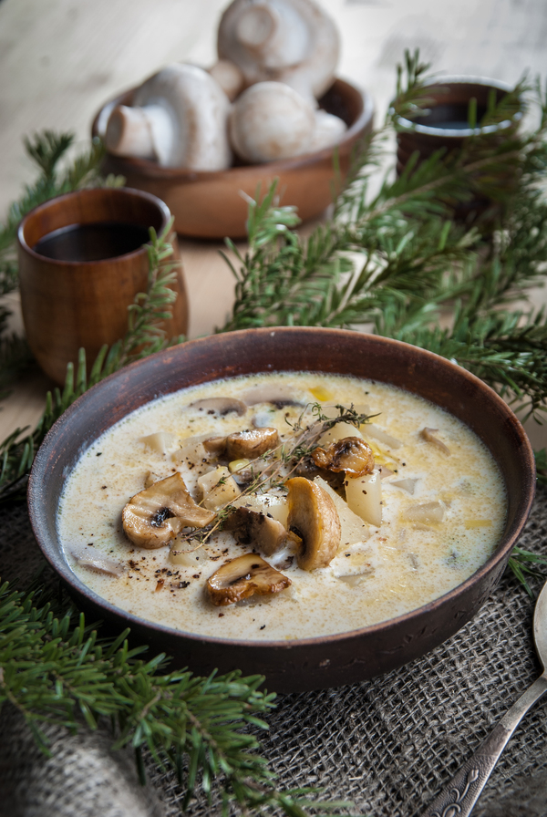

# Грибная похлёбка(по мотивам Властелина Колец)

 [оригинал](https://pikabu.ru/story/gribnaya_pokhlebka_vlastelin_kolets_literaturnaya_kukhnya_4007713)
 ## Состав
* 400г шампиньонов
* 1 небольшая луковица
* 1 лук порей (белую часть)
* 50г сливочного масла
* 2ст.л. муки
* 1 зубок чеснока (порубленный) или сушеный
* 0.5 ч.л. тмина (по желанию)
* 1ч.л. соли
* черный молотый перец, по вкусу
* Примерно по 1 стакану картофеля и сельдерея нарезанных кубиком(по желанию).
* 1 стакан сливок (не критично ,какой жирности)
* веточка тимьяна- по желанию
 
  ## Как готовить
 
 1. В сковороде (или подходящей кастрюле) разогреть на небольшом огне сливочное масло и потушить репчатый и лук порей, порезанные кубиком.Добавить муку и пряности. Влить воду(или бульон) ,постоянно помешивая.Тушить **~10-15 мин**
 2. Порезать грибы(пластинами)
 3.Переложить в кастрюлю , добавить остальные ингридиенты(кроме сливок),влить воду/бульон, довести до кипения и проварить минуту
 4.Убавить огонь так ,чтобы едва кипело, прикрыть крышкой и варить **минут 20-30**
5. Добавить сливки и сразу снять с огня. Попробовать и отрегулировать по своему вкусу. 
  по желанию большую добавить горсть тертого сыра
Дать настояться.
6.Сверху по желанию можно уложить ломтики поджаренных шампиньонов или хрустящий лук, присыпать черным перцем.
 
 

