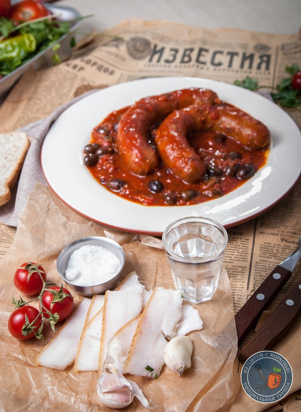

# Сосиски в томатном соусе

 [оригинал](https://pikabu.ru/story/sosiski_v_tomate_ot_prostogo_k_slozhnomu_po_motivam_master_i_margarita_5240931)
 ## Состав

- Сосиски -200-300г.

- половина крупной луковицы или 1 средняя.

- 3-5 средних сладких помидор.

- чайная ложка паприки

- 3-5 зубов чеснока либо домашний сухой чеснок. 

- кусочек острого перца (по желанию)

- соль-сахар-черный перец.
- базилик (по желанию)
- оливки (по желанию)
- тимьян (по желанию)
- орегано (по желанию)
- кр. фасоль (по желанию)

 ## Как готовить
 
 1. Лук нарезать кубиком и пассеровать в ложке-другой масла до полупрозрачного такого состояния.

2. Пока готовится лук, надрежьте помидоры, сложите их в миску и обдайте кипятком. Подержите полминуты и сливайте. Обдайте холодной водой и снимайте кожуру. Нарубите мелко. 
**!note** можно забить и так порезать
 
 3. Добавьте помидоры к луку ,перемешайте и влейте сок.

4.Прибавьте паприку, рубленный чеснок (или сухой чеснок), острый перец.(если вариант с оливками, то базилик, тимьян и оригано дополнительно)

5. Доведите до кипения, убавьте огонь и варите до легкого загустения. На этом этапе соус можно перебить блендером и он будет однороден.(по желанию)

6. Время попробовать и добавить соль и сахар.
 
7.Закладывайте сосиски,ставьте минимальный огонь и готовьте под крышкой 15 минут-30 минут. Сосиски неплохо надрезать(вдоль). Так они берут больше соуса и он по ним не стекает.

  
 
